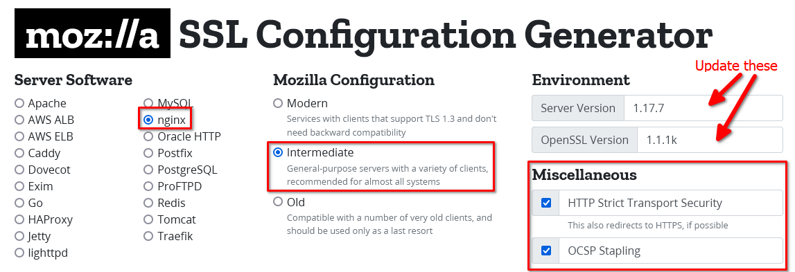

# Manually Deploying an SSL Certificate

In our [README](README.md) file, we use certbot to deploy our SSL certificate. This is great for most personal projects,
or anything where you don't need special certificate types. (Wildcard/Extended Validation/etc)

This document will walk you through the steps of generating prerequisites for obtainign a certificate from a commercial
provider. It does not include any provider-specific instructions, since they are all different.

Some places you might shop for a certificate include -

* [GoDaddy](https://www.godaddy.com/web-security/ssl-certificate)
* [NameCheap](https://www.namecheap.com/security/ssl-certificates/)
* [TheSSLStore](https://www.thesslstore.com/)
* [Cheap SSL Shop](https://www.cheapsslshop.com/)

I'm not in the business of advertising, and this is certainly not a comprehensive list. Do some research, figure out who
you trust that provides what you need, and go frm there.

Some handy SSL References are -

* [Comodo](https://comodosslstore.com/support/glossary.aspx)
* [Rackspace](https://docs.rackspace.com/support/how-to/types-of-ssl-certificates/)
* and we mustn't forget [Qualys](https://www.ssllabs.com/projects/documentation/) who provides a wealth of information
  and tools for SSL configurations.

Moving right along....

## OpenSSL (LibreSSL in modern Linuxes)

The [OpenSSL](https://www.openssl.org/docs/) tool is instrumental in generating what you need for security certificates.

It can generate the KEY, Certificate Signing Request (CSR), and even an unverified self-signed certificate.

OpenSSL is used by calling the tool itself, then a command followed by the options for the command.

You can get a list of commands by running ```openssl help```. For a new user, this list can be daunting, so I would
recommend keeping a [link to the manpage](https://www.openssl.org/docs/manmaster/man1/) handy.

From here, you can drill into what each command does, either by digging into the manpage from the link above, or by
typing ```openssl <command> --help```.

Even this can be daunting, and the manpage isn't much better, so I suggest using the help menus and man pages to find
what is available, and a good search engine to dig into it of it isn't covered here.

## Generating a Certificate Key

The certificate key is used along with the certificate to access it. This is a shared secret, so a Certificate
Authority (CA) can generate the certificate, and you can access it, but no one without the key can access it.

The command I usually use is

```bash
openssl genrsa -out key 2048
```

This generates a 248-bit RSA key, and puts it in a file called key... so

* openssl - calls the OpenSSL software
* genrsa - generates an RSA key
* -out <filename> - writes the key to filename
* 2048 - this can be increased or decreased with just about any base2 derived integer (1024, 2048, 4096, 8192, etc.) but
  we try to make it big without being so big the server is wasting extra time decrypting your cert every time. The
  general
  recommendation as of now is usually 2048 or up to 4096.

## Generating a Certificate Signing Request (CSR)

A Certificate Signing Request is provided to the Certificate Authority, and includes various details about the
requestor, as well as they Key we generated in the previous step.

To generate the CSR, we use OpenSSL again.

```bash
openssl req -new -key key -out csr -sha256
```

This generates the CSR with the Key and stores it in a file called csr with a sha256 hash.

* openssl - Calls the OpenSSL software
* req - Generate a CSR
* -new - Generate a new CSR
* -key <key-file> - Use this key
* out <csr-file> - Output to this file
* -sha256 - Hash with sha256

After running this command, you will be asked a series of questions.

Password is optional, but you should consider using one, especially if you will be sharing the CSR with a third-party.
Common Name is your domain(s). It's best to be factual with all of this information, especially if you are getting an
Extended Validation Certificate.

```bash
You are about to be asked to enter information that will be incorporated
into your certificate request.
What you are about to enter is what is called a Distinguished Name or a DN.
There are quite a few fields but you can leave some blank
For some fields there will be a default value,
If you enter '.', the field will be left blank.
-----
Country Name (2 letter code) [AU]:US
State or Province Name (full name) [Some-State]:New York
Locality Name (eg, city) []:Syracuse
Organization Name (eg, company) [Internet Widgits Pty Ltd]:
Organizational Unit Name (eg, section) []:
Common Name (e.g. server FQDN or YOUR name) []:mydomain.com
Email Address []:myemail@somewhere.com

Please enter the following 'extra' attributes
to be sent with your certificate request
A challenge password []:
An optional company name []:
```

## Obtaining a Certificate

Some places you might shop for a certificate include -

* [GoDaddy](https://www.godaddy.com/web-security/ssl-certificate)
* [NameCheap](https://www.namecheap.com/security/ssl-certificates/)
* [TheSSLStore](https://www.thesslstore.com/)
* [Cheap SSL Shop](https://www.cheapsslshop.com/)

Most of these, you just sign up, request the cert, pay them, and follow their instructions.

After you do this, they will have you download your certificate. Some will have you choose your server software. Since
this repo is all about deploying to NGINX, that is what you would choose of this is the case. Generally, you just want
plain text files.

## Deploying the certificate

Now that you have obtained your certificate, we can deploy it.

Personally, I usually cheat a little by getting a cert with certbot, then replacing it with one I bought.... it
automates the setup for you to a fair extent.

Barring that, here is what we can do;

First, we adjust your server block to listen on the ssl port, and add the SSL certificate and Key location to it.

We change this:

```
server {
    listen 80;
    server_name myproject.com www.myproject.com;

    location = /favicon.ico { access_log off; log_not_found off; }
    
    location /static/ {
        root /var/www/myproject;
    }
    
    location /media/ {
        root /var/www/myproject;
    }

    location / {
        include proxy_params;
        proxy_pass http://unix:/var/www/myproject/run/myproject.sock;
    }
}
```

to this:

This

* redirects all requests on port 80 (non-ssl) to their equivalent address on 443 (ssl)
* Specifies TLS v1.2 and 1.3
* Turns SSL on
* Specifies the location of the certificate and key
    * it doesn't *have* to be in /etc/ssl, but being consistent makes it easier for a team to manage.

```
server {
    listen 80;
    server_name myproject.com www.myproject.com;
    fastcgi_intercept_errors off;
    return 301 https://$host$request_uri;
}

server {
    listen 443;
    server_name myproject.com www.myproject.com;

    location = /favicon.ico { access_log off; log_not_found off; }
    
    ssl on;
    ssl_protocols TLSv1.2 TLSv1.3;
    ssl_ciphers         HIGH:!aNULL:!MD5;

    ssl_prefer_server_ciphers off;
    ssl_session_timeout 10m;
    ssl_session_cache builtin:1000 shared:SSL:10m;

    ssl_certificate_key /etc/ssl/cert-folder/key;
    ssl_certificate /etc/ssl/cert-folder/crt;
    ssl_trusted_certificate /etc/ssl/cert-folder/root_CA_cert_plus_intermediates;
    
    location /static/ {
        root /var/www/myproject;
    }
    
    location /media/ {
        root /var/www/myproject;
    }

    location / {
        include proxy_params;
        proxy_pass http://unix:/var/www/myproject/run/myproject.sock;
    }
}
```

This will show the SSL seal, and your site is officially "secure" but now we want to make it as secure as possible. If
you did my little cheat, you should be mostly to these more secure settings, since certbot takes care of it.

First, we'll start by getting all the variables we want in our server block for a great SSL configuration.

To keep it simple, we can just use Mozilla's [SSL Configuration Generator](https://ssl-config.mozilla.org/)

* Figure out your OpenSSL version with ```openssl version```
* Figure out your Nginx version with ```nginx -v```
* Choose nginx under Server Software
* Intermediate Mozilla Configuration (Modern if you don't care about older clients)
* Turn on HSTS and OCSP Stapling



This will generate new settings for your server blocks. Your block for port 80 should be all right. We really do want
everything to redirect to SSL.

We want to update our ```ssl_protocols, ssl_ciphers, ssl_stapling, ssl_stapling_verify```

We also want to add the ```Strict-Transport-Security``` header. This prevents the client from ever accessing our site
via port 80 moving forward.

Now you will see where it says ```ssl_dhparam /path/to/dhparam;``` in the generated configuration.

We need to generate the new parameter file, rather than use the one the operating system provides.

```openssl dhparam -out /etc/ssl/dhparams2048.pem 2048```

Again, here we go using OpenSSL to generate something.... that tool is a real gem.

* dhparam - generate Diffie-Hellman parameters
* -out <filename> - Put them in this file
* 2048 - another parameter you can adjust with base2 integers to be more secure. 2048 is Good... but you can dial it up
  or
  down as needed.

Now that we have our own parameter file we can update the line in our server block.

```
ssl_dhparam /etc/ssl/dhparams2048.pem
```

Finally, set the resolver.

Your hosting company might provide a DNS server you can use, most people just use Google (8.8.8.8) or Cloudflare
(1.1.1.1) use whoever you trust most.

## Restart nginx

First, make sure everything will work... and that you didn't copy/paste any typos from what I wrote above

```bash
nginx -t
```

If that comes back with errors, fix them... look for the missing semicolon or = sign where a space should be....or maybe
a misspelled path? You might also get errors if your SSL key isn't a match for the certificate.

Once nginx says everything is OK, you can do the actual restart.

```bash
systemctl restart nginx
```

## Bonus - PFX files

You can generate a pfx file with this OpenSSL command.

```bash
openssl pkcs12 -export -out certificate.pfx -inkey <path-to-key-file> -in <path-to-cert-file> -certfile <path-to-ca-bundle-file>
```

You will be prompted for a password, which you should set.
